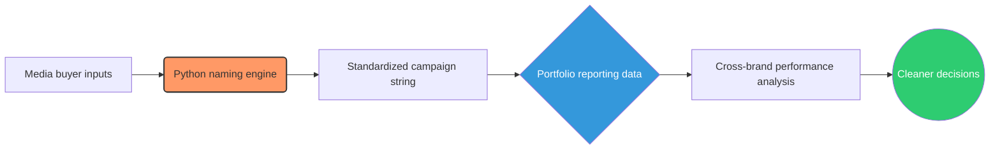

# Campaign Naming and UTM Engine

Performance data is only as good as the naming convention behind it. When a multi-brand portfolio lets media buyers name campaigns by hand, the data arrives inconsistent: the same channel spelled three ways, missing funnel stages, UTM parameters that drift between brands. You cannot compare what you cannot group, and you cannot group what was never named the same way twice.

This engine standardizes campaign naming and UTM construction across the portfolio. A media buyer supplies the inputs, the engine returns a consistent, machine-readable campaign string and a matching UTM URL. Every brand follows the same schema, so the data lands clean enough to analyze without manual cleanup.

## How it works

A buyer picks a schema and provides the values for it. The engine joins them in a fixed order with underscores, prefixes the brand, and produces a single campaign string. The same inputs build the UTM URL, which removes the manual entry that usually corrupts tracking.



## Schemas

The engine ships with three schemas, each defining the fields and their order for a channel type:

- **Paid social prospecting:** Channel, Geo, Funnel, Objective, Audience, Placement, Campaign ID
- **Influencer and UGC:** Channel, Creator ID, Asset Type, Batch, Gender, Theme, Product Category, Variant, Length
- **Paid search:** Channel, Geo, Funnel, Match Type, Category, Ad Style

Add a schema by adding an entry to the `SCHEMAS` dictionary. No other code changes.

## Example

```python
engine = GrowthNamingEngine(brand_prefix="RETAIL_X")

launch_data = {
    "Channel": "Meta",
    "Geo": "US",
    "Funnel": "Pros",
    "Objective": "Conversion",
    "Audience": "Interest-HighIncome",
    "Placement": "AdvantagePlus",
    "CampaignID": "L01",
}

camp_name = engine.generate_campaign_name("PAID_SOCIAL_PROSP", launch_data)
# RETAIL_X_Meta_US_Pros_Conversion_Interest-HighIncome_AdvantagePlus_L01

url = engine.generate_utm_string(
    "https://brand-x.com", "facebook", "paid_social", camp_name, "Hero-Video-V1"
)
```

The code is in [`naming_engine.py`](./naming_engine.py).
